<div align="center">


<br>

**도덕경 81장을 근거로 삼는 상담 하네스**

지어낸 구절로 위로하지 않습니다. 인용은 전부 파일에서 읽어옵니다.

<sub>

[설계 문서](SPEC.md) · [저본과 출처](text/SOURCE.md) · [라이선스](LICENSE)

</sub>

</div>

---

## 무엇인가

고민을 말하면 도덕경 81장에서 관련 장을 찾아, 그 구절이 지금 당신 상황에서
무엇을 말하는지 풀어주고 실천까지 제안하는 **Claude Code 하네스**입니다.

서버도 앱도 아닙니다. 마크다운 데이터와 스킬 파일이 전부이고, Claude Code
세션 위에서 돕니다.

## 왜 만들었나

LLM에게 그냥 "도덕경 관점에서 조언해줘"라고 하면 두 가지가 깨집니다.

**첫째, 인용이 가짜입니다.** 모델이 기억으로 구절을 지어냅니다. 그럴싸하지만
원문에 없는 문장입니다. 위로가 근거를 잃습니다.

**둘째, 매번 다릅니다.** 어떤 날은 점집 같고 어떤 날은 위키 요약입니다.

그래서 이 하네스는 두 가지를 강제합니다.

| | |
|---|---|
| **근거 있는 인용** | 나가는 도덕경 문장은 100% `text/` 파일에서 읽은 것. 기억에서 생성 금지. 스크립트로 대조해 검증한다. |
| **재현되는 형식** | 듣기 → 분해 → 검색 → 인용 → 해석 → 실천. 여섯 단계를 항상 거친다. |

## 어떻게 도는가

<div align="center">

</div>

```
"팀장이 자꾸 내 일에 끼어들어서 미치겠어"
   │
   ├─ 분해     통제욕 · 인간관계 · 무력감
   │
   ├─ 검색     text/ 에서 situations 매칭
   │           → 17장 · 22장 · 8장
   │
   ├─ 인용     파일을 열어 원문·번역을 복사
   │           (Read 없이 인용하면 규칙 위반)
   │
   ├─ 해석     당신이 쓴 단어로 구절을 잇는다
   │
   └─ 실천     내일 당장 할 수 있는 크기로
```

기록은 `sessions/`에 날짜별로 쌓입니다. "저번에 뭐라 했더라"를 위한 것입니다.

<br clear="right">

## 장 파일의 구조

`text/08.md` 하나를 열면 네 개의 층이 있습니다. 이 층을 나눈 것이 이
프로젝트의 핵심 설계입니다.

| 섹션 | 무엇 | 쓰임 | 고칠 수 있나 |
|---|---|---|---|
| `원문` | 한문 | 인용 블록에만 | ❌ 퍼블릭 도메인 |
| `번역` | 저본 번역 | 인용 블록에만 | ❌ 남의 저작물 |
| `현대어` | 구어체 다리 | 해석에 녹여서 | ✅ 우리 글 |
| `주해` | 해석 재료 | **사용자에게 안 보임** | ✅ 우리 글 |

`번역`이 있는데 `현대어`를 또 두는 이유는, 저본 번역이 정확하지만 문어체라
고민 상담에 그대로 붙지 않기 때문입니다. "뭇 사람이 싫어하는 낮은 곳"과
"다들 가기 싫어하는 아래쪽"은 같은 말이지만 닿는 거리가 다릅니다.

`주해`에는 **오독 주의**가 반드시 붙습니다. 예를 들어 8장(上善若水)은
부당한 대우를 받는 사람에게 들이대면 "참아라"가 되어 가해를 정당화합니다.
도덕경 상담의 진짜 위험은 인용이 틀리는 것이 아니라, **맞는 인용을 틀린
사람에게 쓰는 것**입니다. 그래서 그 경계를 데이터에 박아두었습니다.

## 안전

자해·자살·학대 신호가 보이면 상담을 중단하고 전문기관 안내로 전환합니다.
도덕경 해석을 얹지 않습니다. 이 하네스는 심리 상담을 대체하지 않습니다.

## 상태

| 단계 | 내용 | |
|---|---|---|
| M1 | 저본 확정 · 8장 샘플 | ✅ |
| M2 | `counsel` 스킬 초안 | 🔨 |
| M3 | 형식 재검토 | |
| M4 | 나머지 80장 | |
| M5 | 인용 대조 테스트 | |
| M6 | 실사용 5세션 | |

## 저본

한국어 위키문헌 [「번역:도덕경」](https://ko.wikisource.org/wiki/번역:도덕경)
— 81장 완역, CC BY-SA 3.0 / GFDL 1.2.

저본 번역은 오탈자도 고치지 않고 그대로 옮깁니다. 고치면 대조가 깨져서
인용 검증이 무의미해지기 때문입니다. 고칠 것이 있으면 위키문헌에 기여해
저본 자체를 고칩니다.

## 라이선스

**CC BY-SA 4.0.** 저본이 BY-SA라 copyleft가 따라옵니다. 자세한 것은
[LICENSE](LICENSE)와 [text/SOURCE.md](text/SOURCE.md).

<div align="center">
<br>

<br><br>
<sub>上善若水 — 가장 좋은 것은 물과 같다</sub>
</div>
